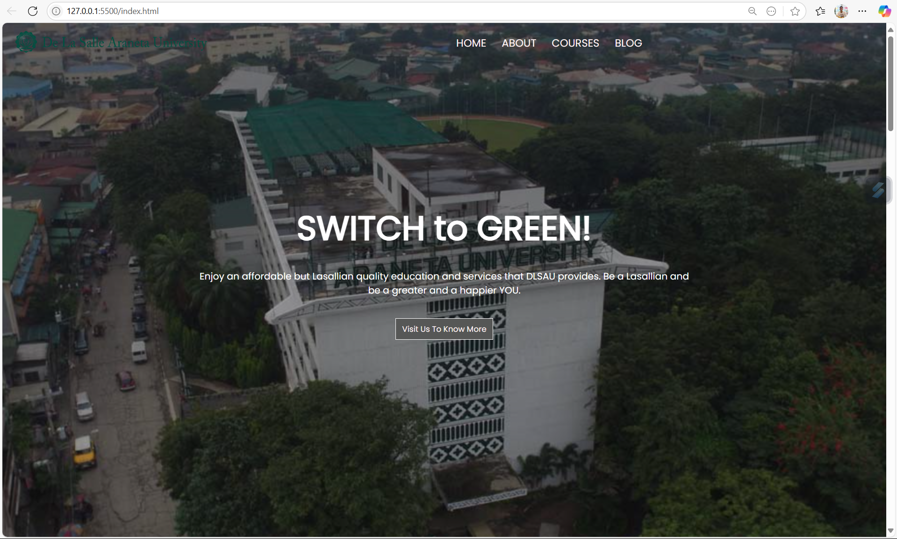
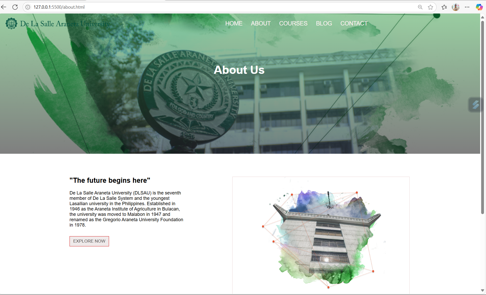
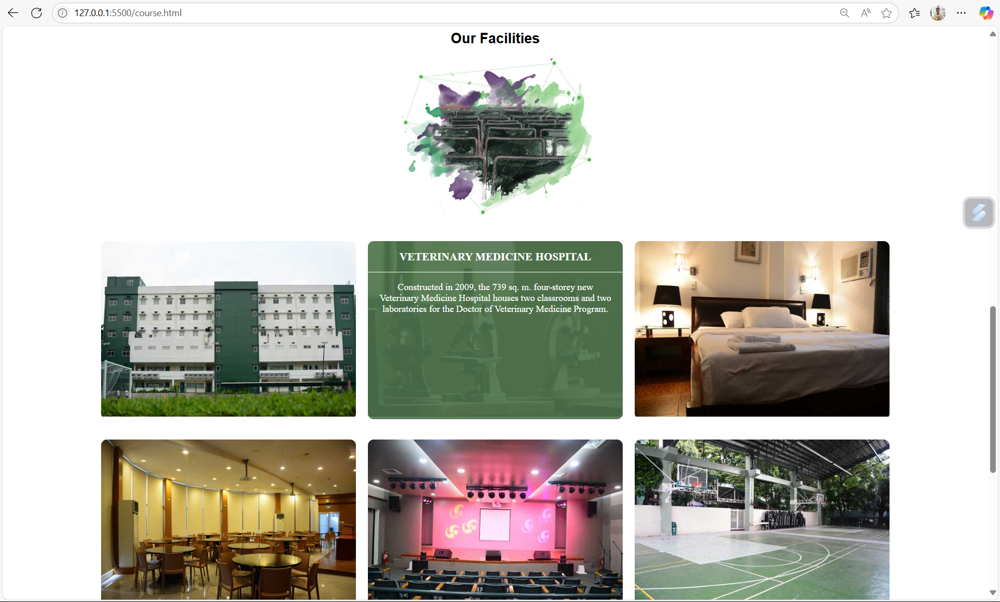

# 🌿 Animo Website

The **Animo Website** is a promotional and informational site created for **De La Salle Araneta University (DLSAU)**. It showcases the institution’s programs, facilities, testimonials, and campus life through a visually appealing and responsive design built with **HTML**, **CSS**, **JavaScript**, and **Bootstrap**.

---

## 📌 Project Overview



This website was designed to:

- Encourage prospective students to enroll
- Inform the public about the university’s programs and facilities
- Provide a user-friendly overview of what DLSAU offers

---

## 🎯 Key Features

### 🏫 Hero & Welcome Section
- Large header with motivational slogan: “**SWITCH to GREEN!**”
- Eye-catching call-to-action button that leads to course offerings

### 📚 Programs Offered
- Overview of four major colleges at DLSAU:
  - Veterinary Medicine & Agricultural Sciences
  - Business, Management, & Accountancy
  - Education
  - Arts, Sciences & Technology

### 🏗️ Campus Facilities
- Detailed descriptions and images of campus buildings and venues
- Hover effect reveals information about each facility

### 💬 Testimonials
- Student feedback with star ratings and photos
- Enhances the credibility and community feel of the school

### 📣 Call to Action
- Invitation to enroll and contact the university

### 👣 Footer
- About section with social media links (Facebook, Twitter, Instagram, YouTube)
- Credits

---

## 🧰 Technologies Used

- **HTML5** – Page structure
- **CSS3** – Styling (with external `index.css` and `course.css`)
- **JavaScript** – Interactive navigation and menu toggle (`index.js`)
- **Bootstrap** – Responsive design and icons
- **Google Fonts** – Custom typography
- **Font Awesome** – Icons for UI and social media

---

## 💡 How to Run the Project

1. **Clone or download** the repository:
   ```bash
   git clone https://github.com/yourusername/animo-website.git
